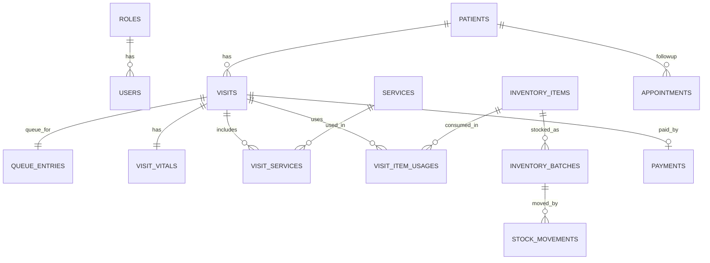

# ดงมหาวันคลินิก: System Design

## แนวคิดการออกแบบ
- ออกแบบให้รองรับจุดใช้งาน 3 จุดหลัก: Reception, ห้องตรวจ/ห้องพยาบาล, ห้องชำระเงิน
- ใช้หน้าแบบ server-rendered เพื่อให้ติดตั้งง่ายบน XAMPP/Laragon และดูแลง่าย
- โฟกัส workflow แบบ `ลงทะเบียน -> เข้าคิว -> บันทึกการพยาบาล -> ใช้บริการ/ยา -> ชำระเงิน -> ใบเสร็จ`

## ER Diagram

## Flow การใช้งาน
1. Reception ค้นหาหรือสร้างผู้รับบริการ แล้วสร้างคิวพร้อม Visit
2. Nurse เปิดแฟ้ม Visit บันทึกอาการสำคัญและ vital signs
3. Nurse เพิ่มบริการและยา/เวชภัณฑ์ที่ใช้ ระบบตัด stock ตาม FEFO
4. Nurse กดส่งไปชำระเงิน
5. Cashier รับเงิน พิมพ์ใบเสร็จ และปิดงาน Visit
6. Admin ดู dashboard, export CSV, และ backup SQL

## โมดูลหลัก
- `Auth`: login / logout / role guard
- `Patients`: ลงทะเบียนและค้นหาผู้รับบริการ
- `Queue`: คิวรายวันและสถานะ
- `Visits`: บันทึกการตรวจและการพยาบาล
- `Services`: รายการบริการและราคา
- `Inventory`: คลังยา, ล็อต, stock movement, expiry alert
- `Payments`: รับชำระเงิน, ใบเสร็จ
- `Reports`: dashboard, export CSV, backup SQL

